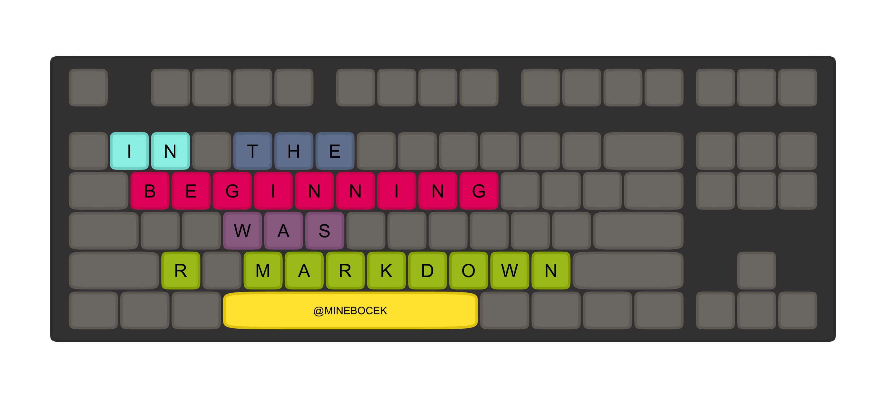

<!-- README.md is generated from README.Rmd. Please edit that file -->

# ggkeyboard

This is a fork of [sharlagelfand](https://github.com/sharlagelfand)’s
fantabulous [ggkeyboard](https://github.com/sharlagelfand/ggkeyboard)
package, butchered to make the following keyboard for my talk titled “In
the beginning was R Markdown” (title, though not content, inspired by
the essay “In the beginning was the command line” by Neal Stephenson).
It makes the following keyboard and otherwise doesn’t promise to do
anything else as I may have butchered Sharla’s code while getting this
to work. If you want the real thing go to the original
[ggkeyboard](https://github.com/sharlagelfand/ggkeyboard) repo.

``` r
library(ggkeyboard)

ggkeyboard(
  in_the_beginning_full, 
  palette = keyboard_palette("in_the_beginning"), 
  adjust_text_colour = FALSE
)
```



If, for some reason, you want this package, you can install from GitHub
with the following:

``` r
# install.packages("devtools")
devtools::install_github("mine-cetinkaya-rundel/ggkeyboard")
```

But you probably want
[this](https://github.com/sharlagelfand/ggkeyboard) instead.
